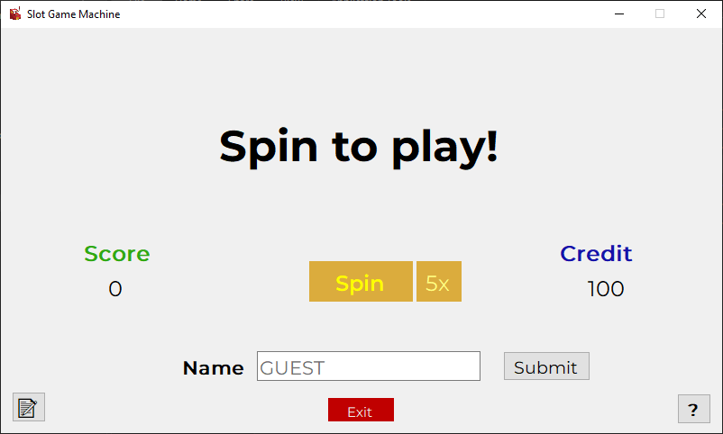
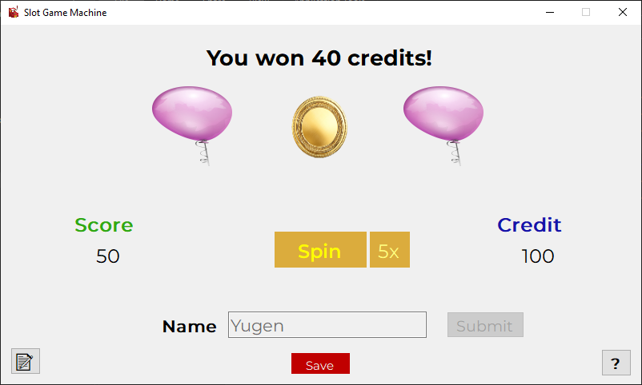

# Slot Game Machine

Slot Game Machine is a C# WinForms application that simulates a slot machine game. The game allows users to spin the reels and try their luck in winning credits.

## Features

- Three spinning reels with different slot machine items (images).
- User can click the "Spin" button to spin the reels once, deducting 10 credits from their balance.
- User can click the "Spin 5x" button to spin the reels five times in a row, deducting 40 credits from their balance.
- The game calculates credits won based on the combination of slot machine items appearing on the reels.
- User's credit balance is displayed on the screen.
- User's total score is displayed on the screen.
- User can view the high scores by clicking the "Show Scores" button.
- Users can add new items to the slot machine by placing PNG images in the `assets/slot_machine_items/` folder.

## Screenshots

## Getting Started

1. Clone the repository to your local machine.
2. Open the project in Visual Studio.
3. Build and run the application.

## Requirements

- .NET Framework or .NET Core runtime installed.

## How to Play

1. Enter your name in the provided text box and click the "Submit" button.
2. Click the "Spin" button to spin the reels once, or the "Spin 5x" button to spin five times.
3. Try to match three identical slot machine items on the reels to win credits.
4. Your credit balance and score will be updated accordingly.
5. Click the "Show Scores" button to view the high scores.

## How to Add Slot Machine Items

If you want to add to the slot machine, follow these steps.

1. Prepare your item images in PNG format.
2. Copy the PNG images to the `assets/slot_machine_items/` folder in the project directory.
3. Make sure the image filenames are unique and descriptive, e.g., `banana.png`, `balloon.png`, `coin.png`, etc.

The application will automatically load an use these new images as slot machine items during the game.
The new items will appear on the reels along with the existing ones, adding variety and excitement to the gameplay.

Please note that the slot machine items' images should at least have approximately the same dimensions
as the existing ones to ensure a visually consistent user experience.

## License

This project is licensed under the MIT License - see the [LICENSE](LICENSE.txt) file for details.

## Acknowledgments

- The slot machine items' images are used for demonstration purposes only and are not for commercial use.

## Credits

Developed by [xYugen](https://www.github.com/xyugen/).

## Bugs and Issues

Please report any bugs or issues on the [Issue Tracker](https://www.github.com/xyugen/slot-game-machine/issues).